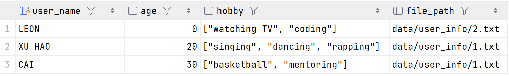
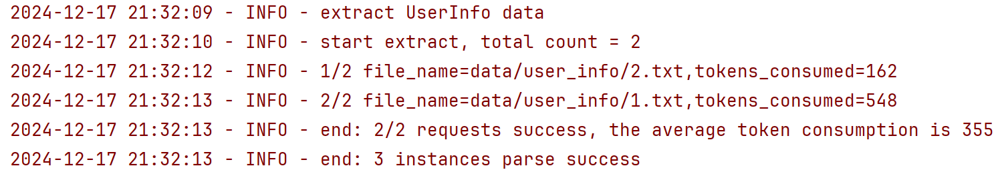

# InfoExtract


# 基于大模型的信息提取框架

支持以Qwen、GLM以及兼容OpenAI SDK的模型（如DeepSeek等）作为大模型后端，完成信息提取任务。

## 特色

1. 支持异步，可从每分钟并发数、每分钟消耗的Token数、瞬时并发数三个维度控制并发
2. 支持SQL数据库，自动创建表并添加数据
3. 强大的JSON解析功能，通过定制元类，支持类型自动转换，支持自定义字段验证逻辑
4. 完善的日志系统
5. 支持PDF与TXT格式解析，对于PDF论文，自动从正文中剔除References

## 安装
```shell
pip install -r requirements.txt
```

## 使用
1. 在 core/config.py 中配置数据库与 API_KEY ，申请地址：[DashScope](https://dashscope.aliyun.com/) [GLM](https://open.bigmodel.cn/dev/api/normal-model/glm-4) [DeepSeek](https://api-docs.deepseek.com/zh-cn/)
2. 定义好待提取信息的类，须继承自`CheckMixin`与`Checked`，须提供类型注解，文档注释（将成为提示词的一部分）以及针对字段的验证函数是可选的，像demo.py那样
3. 配置好`TaskConfig`，运行`build_task`

## Demo效果
只需简单配置 即可开始信息提取
```python
class UserInfo(CheckMixin, Checked):
    """'hobby' summarized from what he often does"""
    user_name: str
    age: int
    hobby: list[str]

    @filed_validator("user_name")
    def check_user_name(self, v: str):
        """我只想要大写的用户名"""
        return v.upper()

task_config = TaskConfig(
    input_file_type="txt",  # 输入类型 可以为pdf或txt
    dataset_dir_path=Path("./data"),  # 数据集文件夹所在的文件夹路径
    dataset_name="user_info",  # 数据集文件夹名称
    dataset_theme="user",  # 数据集的主题
    one_article_to_many_instance=True,  # 一篇文章可能有多个实例
    table_primary_key="user_name",  # 指定用户名为主键
    filter_by_file_path=True,  # 根据file_path过滤存在的数据
    post_check_func=not_contains_chinese,  # 针对大模型的回复的检查函数: 不包含中文
    post_processing_hooks=partial(save_to_excel,  # 针对提取结果的处理函数: 保存到excel
                                  ignore_fields=[],
                                  output_name="output.xlsx",
                                  output_dir=Path("./output")),
)
asyncio.run(build_task(task_config, UserInfo))
```

SQL数据库截图


日志截图


## 项目的解析器强大在哪里
考虑大模型回复了下面这样糟糕的JSON字符串
```json
[
  {"user_name": "uncleared","age": "20","hobby": "sing,dance,rap"},
  {"user_name": "xu","age": null,"hobby": "sing;dance;rap;basketball"},
  {"user_name": "kun","age": "","hobby": ["sing","dance","rap","basketball"]}
]
```
使用本项目的解析器，demo.py可以解析出如下结果
```shell
UserInfo({'user_name': '', 'age': 20, 'hobby': ['sing', 'dance', 'rap']})
UserInfo({'user_name': 'XU', 'age': 0, 'hobby': ['sing', 'dance', 'rap', 'basketball']})
UserInfo({'user_name': 'KUN', 'age': 0, 'hobby': ['sing', 'dance', 'rap', 'basketball']})
```

`uncleared`的字段自动置空；`str`类型或空值的`age`字段可以自动转换为`int`型；使用`,;`分隔的字符串会自动转换为列表

## 从数据库重建类实例
无需编写SQL语句 自动从数据库记录重建实例
```python
user_adapter = SQLAdapter(UserInfo, DATABASE_URI)
for file_path, item in user_adapter.fetch_all():
    print(file_path, item)
```
效果如下
```shell
data/user_info/2.txt UserInfo({'user_name': 'LEON', 'age': 0, 'hobby': ['watching TV', 'coding']})
data/user_info/1.txt UserInfo({'user_name': 'XU HAO', 'age': 20, 'hobby': ['singing', 'dancing', 'rapping']})
data/user_info/1.txt UserInfo({'user_name': 'CAI', 'age': 30, 'hobby': ['basketball', 'mentoring']})
```